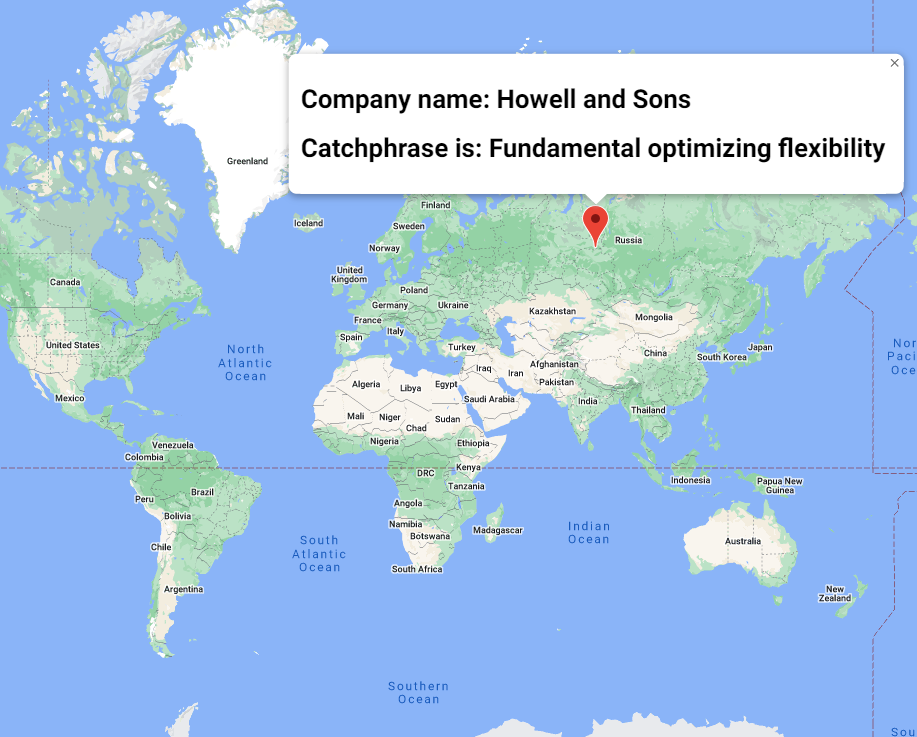

# Maps
This is a project made using TypeScript, Javascript classes and interafces
Creates a MAP with the google maps library that provides us an object called map and a bunch of methods in @Types declaration files

This is a preview of

# Launch
Run parcel index.html

Created By Sergio Paniagua López
